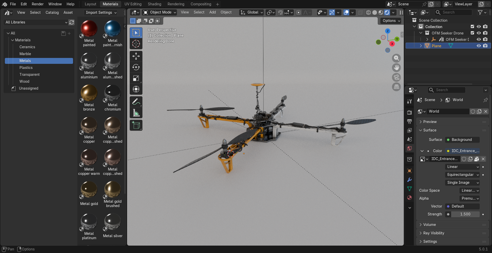

# 🚀 Howest Blender 

Welcome to our custom Blender build! This repository provides a pre-configured version of Blender tailored specifically for high-efficiency visualization workflows.

## 📥 Download Recommendation
While Blender is available via the official website, we strongly recommend downloading **this version**. It comes pre-configured with all essential add-ons enabled and includes a custom **visualisation template** designed to remove interface clutter and streamline your workflow by hiding unnecessary tools.

---

## ✨ Key Features
* **Ready-to-Go:** No need to spend hours toggling add-on settings; everything is enabled by default.
* **Clean Interface:** Our custom template removes the "default cube" clutter and redundant UI panels.
* **Optimized Performance:** Pre-set render settings for faster visualization previews.
* **Wide range of default materials**: Plastics, metals, woods, glasses,...

## 🛠 Installation & Usage
1. **Download** the latest release from the [Releases](../../releases) page.
2. **Run** the exe and select your preferred location (e.g., `C:/Blender_Viz`).
3. **Select** visualisation template by selecting it in the splash screen or selecting **File** -> **New** -> **Visualisation**